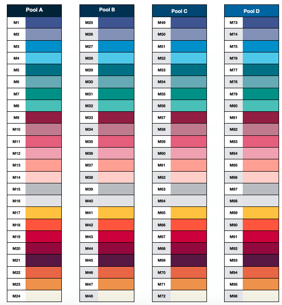

# Proyecto_Bionf2020

I'm currently working with my PhD project entitled **"Composición de la microbiota del recién nacido y su asociación con la microbiota presente en la leche materna en mujeres con sobrepeso y obesidad"**. The aim of the project is to know the composition of the microbiota present in the gut from mother-newborn dyads and mother's milk. The following describes the part of the process carried out so far:

## Samples
Stool samples from mother-newborn dyas have been sequenced. As controls:
  * 3 negative controls: 
    * Negative control for the milk sample extraction.
    * Negative control for the faeces extraction.
    * Negative control for the library preparation.
  
  * 1 Positive control (Mock community). 

## Sequencing
The sequencing by synthesis was performed through the Illumina Miseq 2x250 platform.For the library preparation the protocol described by  the Earth Microbiome Project (EMP) was used with some modifications,briefly described below:

A first PCR was realized in order to amplificate the 16S rRNA gen and to attach barcodes (multiplex) in the 3' region. For this PCR, 1 Forward primer (TGTGCC) and 24 different Reverse primers were used due this, a total of 96 samples were clustered in 4 pools, called Pool A, Pool B, Pool C and Pool D. The following Figure exemplify this:

Next, the index step was done. In this step Illumina adpapters were joining to the products of the first PCR. For this, 1 Forward primer was the same in all the pools and again, 4 different Reverse primers were used. The Illumina adapters are all different from the previous step. Finally, all the pools were mixed and the resulting pool called "Master pool" was sequenced. As a result the Center where sequencing was done, upload the results in Illumina's BaseSpace, these are 8 files grouped by pools, each one have 1 file for the Forward reads (`Pool#_ R1.fastq.gz`) and one file for the Reverse reads (`Pool#_ R2.fastq.gz`). 

**Note**:It's important to mention that before the upload of the files, the Sequencing Center  performed a quality control and the trimming of the Illumina index sequences. 

## Bioinfo project  
A set from data and metadata obtained from the study was selected. The organization of the directories of this repo are detailed below:

### `/bin/`
Contains the necessary scripts to:
 * Run the analysis of microbiota composition from raw data using the Ampkt's pipeline (`Ampkt_PoolA`).
   * `Pre-Processing` for sequences from PoolA, just 1 of the 24 different reverse barcodes.
   * `Clustering`using UPARSE.
   * `Filtering` to remove unwanted reads.
   * `Assigning` taxonomy to each OTU.  
   
   **Note**: I'm still working with the other sequences (Thanks to Camille for the advices!) 
 * Run the next step 

### `/data/`
Contains two sub directories:   
 * `raw` which contains two folders with the results downloaded from BaseSpace for the PoolA and Pool B. Each folder contains 2 files, one generated for the Forward reads (`*_R1_*.fastaq.gz`) and other for the Reverse reads (`*_R2_.fasta.gz`). 

### `/meta/`
Contains the file `sample-metadata`, a text file that specify: 
 * Sample ID:

el ID de la muestra, cada una de las secuencias del cebador *Reverse* utilizado, la secuencia del cebador *Forward*, el pool y la posición en el posillo de cada muestra, además del tipo de muestra que es. 

Moreover, contains the file `Antropometria_madre.tsv` in which antrophometric data from participant mother's where collected. As part of the project,after 1 month of childbirth the participants were visited, antrophometric meditions from the mother and the newborn were obtained. Some other information like type of delivery, clinic where they belong, and some other information are collected.
 * Age

 edad, peso, estatura, semanas de gestación (SDG).  
 
### `/output/`
Contain different subdirectories:  

 * `ampkt_results`: Here the data generated from ampkt pipeline are saved.
 * `phyloseq_results`: Here the tables and graphs generated from phyloseq are saved. 
 * `antrhopometric_results`: Here graphs generated from analysis of the mother's metadata are saved. 

### `/reports/`
Contains two subdirectories: 
 * `images`: In this subdirectory images that were used for the reports or README, for example, are stored. These images are not related  nor product of the scripts. 
  
 * `reports`: In this subdirectory reports generated from the results obtained are saved, they are RMarkdown type.An example [Reporte microbiota de la leche](reports/reports/Composición de la microbiota de la leche materna.html).
 

