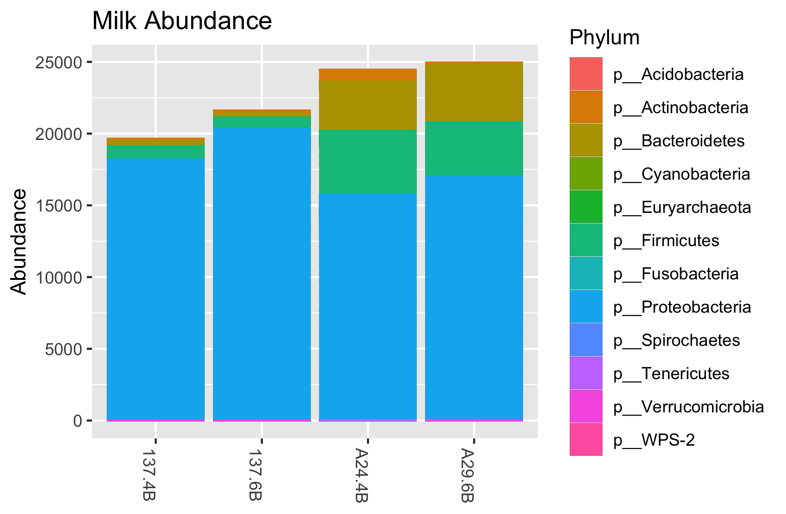
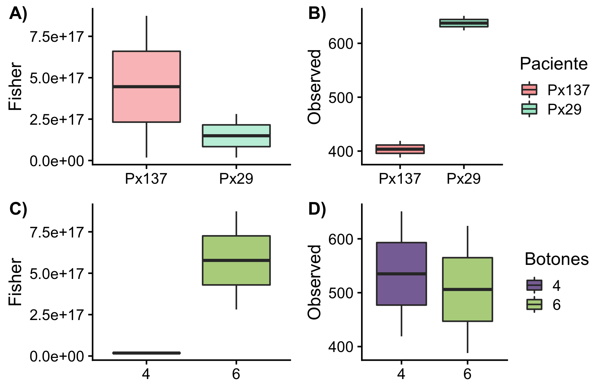

# Composición de la microbiota de la leche materna

En este reporte se mencionan los resultados obtenidos a partir del archivo `leches_prueba.biom` que se encuentra en el directorio *output*. 

##Muestras
Aunque este no es el resultado del análisis que lleve a cabo utilizando el *pipeline* de AMPkt, decidí utilizar este archivo para practicar una vez que tenga mis datos. Este archivo se generó a partir de QIIME 1 y son los resultados de la secuenciación de 4 muestras de leche materna de dos voluntarias (Px 137 y Px29) utilizando 4 y 6 mL de leche. 

El análisis del archivo .biom se llevó a cabo en RStudio utilizando el paquete `phyloseq` y el ambiente `tidyverse`. 

##Resultados

###Reads
Dentro de los resultados obtenidos se encuentra el número de lecturas en cada muestra. La leche proveniente de la paciente Px29 contuvo la mayor cantidad de lecturas (promedio = 24701.5) a comparación de la paciente Px137 (promedio 20 607). 

###Composición
En cuanto a la composición de microbiota presente en la leche materna de las pacientes, se muestra la gráfica siguiente:


**Figura1**. Microbiota presente en la leche humana. 

De manera gráfica se puede observar lo que anteriomente se menciono, la muestra de la Px29 contiene mayor abundancia de lecturas, existiendo una mayor prevalencia de microorganismos Firmicutess, Bacteroidetes y Actinobacteria. Sin embargo en la leche de ambas pacientes se puede observar un mayor predominio del filo Proteobacteria. 

No obstante utilizar los reads para ejemplificar la abundancia de las muestras no es proxy para determinar la abundancia de OTU's, se utilizó una tabla de presencia-ausencia empleando el paquete `vegan`, utilizando el siguiente comando:

```
milk_decostand <- decostand(otu_table(milk_microbiota), method="pa")
```

### Diversidad Alfa
Con la tabla generada estimamos la diversidad alfa utilizando para ello dos metricas (Observada y Fisher), los resultados se guardan en la variable `Diversity_table`. Posterior para poder analizar las diferencias que pudieran existir entre las variables Paciente y mL de leche empleados, era necesario utilizar el archivo *mapping* sin embargo al realizar la inspección del archivo .biom se observó que **no contenía** la tabla del mapping file. 

Para poder continuar con el proceso, se crearon dos columnas nueva en donde se pusieron las variables a evaluar, el número de pacientes y el número de botones o pellets provenientes de los 4 o 6 mL de leche utilizada. 

```
Paciente <- c("Px137", "Px137", "Px29", "Px29")
Botones <- c("4", "6", "4", "6")

Diversity_table <- cbind(milk_diversity,Paciente, Botones)
```

Con los datos de la tabla de diversidad ya modificadase se realizaron las pruebas ANOVA para observar si existía diferencia entre las pacientes y entre los mL de leche utilizada. A continuación se muestran las gráficas generadas. 


**Figura 2**.Diversidad Alfa: metricas de **A)** Fisher y **B)** Observadas entre pacientes y metricas de **C)** Fisher y **D)** Observadas entre botones (mL) de leche.  

En la gráfica 2 se observa la comparación de la metrica de Fisher entre las dos pacientes(Figura A), no existió diferencia significativa entre ambas muestras (P=0.438),pero si existió diferencia entre ellas al ser comparadas utilizando la métrica de Observación(P=0.007)(FiguraB). 

Para el caso de los diferentes botones (mL) de leche utilizados vemos que también existe diferencia al utilizar la diversidad de Fisher (Figura C) y no la Observada (Figura D). 

##Diversidad BEta 
Debido a que unicamete se presentaron 4 muestras no fue posible realizar las ordinaciones mediante el siguiente comando:

```
NMDS=ordinate(suelo, method = "NMDS", distance=bray)`
```
La consola muestra el siguiente mensaje:

> Warning message:
In metaMDS(ps.dist) :
  stress is (nearly) zero: you may have insufficient data

##Conclusiones

Fue posible conocer la composición de la microbiota presente en la leche materna de las participantes del estudio. Se pudo observar que existe una diferencia en las diversidades alfa si se utiliza una métrica o la otra, dependiendo de la paciente o el número de mL de leche utilizado, siendo esto un factor que se debe de tener en consideración al momento de realizar los análisis de las secuencias *per se*. También para poder realizar este trabajo es necesario tener más datos para poder realizar el análisis de la diversidad Beta. 

Utilizar este "toy example" fue un buen comienzo para establecer el *worflow* de trabajo, una vez obteniendo los resultados de las demás muestras trabajadas con el *pipeline* de AMPtk.


